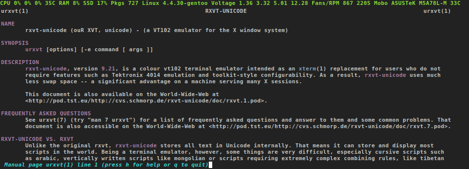

Status line for urxvt (rxvt-unicode) based on tabbed and tabbedex.

The sole purpose of this extension is to make it easy for you to keep track of things that you are interested to monitor while hacking something in the terminal. You can achieve something similar with other non-rxvt terminals:

```bash
while true; do tput sc;tput cup 0 0; tput el;printf '%s' 'Hello World';tput rc;sleep 0.5;done &
fg # CTRL + C to stop it
```

Shoutout to the tabbed authors, and the tabbedex fork.




# Installation

Simply place it in **/usr/lib/urxvt/perl/** for
system-wide availability or in **~/.urxvt/ext/** for user-only availability.
You can also put it in a folder of your choice, but then you have to add this
line to your **.Xdefaults/.Xresources**:

```bash
# Don't type ~ or $HOME
URxvt.perl-lib: /home/user/your/folder/

# Make sure to remove tabbed and/or tabbedex
# from the used extensions
URxvt.perl-ext-common: pinky

# Those colours are defined by you

# 0, 2 refer to:
*.color0: #222222
*.color2: #8ae234

URxvt.pinky.pinky-fg: 2
URxvt.pinky.pinky-bg: 0
```

# Usage

There are two ways that you can use to update the status line.

The first way is the most simplistic, use your favourite 'echo, print, printf' command to update the status line.

```bash
while true; do
  printf '\033]777;pinky;%s\007' 'Hello World'
  sleep 5
done &  # <-- "daemon mode"
```

The second way is bit more advanced, it allows you to update the status line from any other application/window by using the window id:


```bash
# The extension is calling a callback function each 2 seconds
# no need to add any "sleep" in here
xprop -id 0x2200009 -format _PINKY_NAME 8s -set _PINKY_NAME 'Hello World'
```

# Requirements

* urxvt (rxvt-unicode) compiled with support for perl
